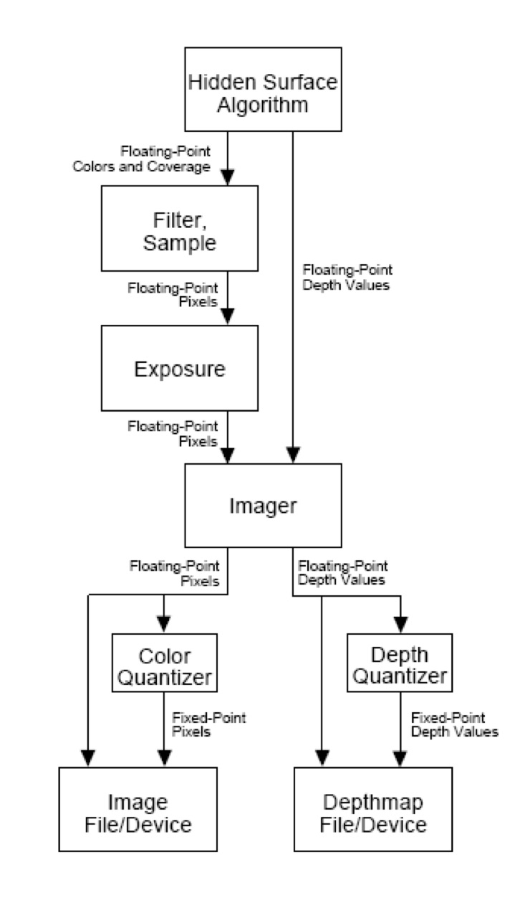

+++
# Date this page was created.
date = 2018-11-10T00:00:00
layout = "project"

# Project title.
title = "2. A RenderMan Graphics Interface"

# Project summary to display on homepage.
summary = """
 This is a curriculum project in CS285 Advanced Image Synthesis at UCSB. 
 I'm responsible for all the code and pipeline design
 """
 
image_preview = "featured.jpeg"

# Tags: can be used for filtering projects.
# Example: `tags = ["Computer Graphics", "Rendering"]`
tags = ["Computer Graphics","Rendering"]

# Optional external URL for project (replaces project detail page).
external_link = ""

# [header]
# image = "featured.jpeg"

+++

# Overview
This is a Reyes-style, micropolygon-based architecture that processes input through a RenderMan-like C interface. It contains the main parts of a fully functional RenderMan interface.   
I independently accomplished it under the guidance of Prof. Pradeep Sen  

The main process of the program is as follows:  
1. Read the Metafile format RIB (Renderman Interface Bytestream) or C bindings.  
2. Initialize framebuffer, viewer position, world coordinate system, etc.. 
3. Start the scene description.
4. Rasterize scene objects.
5. End the frame.

# Features
## Main Rendering Pipeline Design
The overall rendering pipeline is based on the Renderman interface standard: (1) Describe the viewer, then the world. (2) Start/end the scene description. (3) Start/end the frame.
I implemented most parts of the Renderman pipeline described as follows:

### Camera settings
We can use RiProjection() and RiTranslate() to set up the perspective transformation.
The camera setting is described below. It is a left-hand coordinate system, which is different from OpenGL.

### Rasterizer
For short, it is able to set up a rudimentary graphics state, render primitives with bound shaders, and determine the visibility using a z-buffer algorithm. Rendering primitives in a Reyes architecture involves dicing them up into a micropolygon grid, shading the grid, and then busting up the grid into micropolygons that are bounded and sampled into screen space locations. Finally, it will save out the images into a file specified by RiDisplay().

A demo scene:

### Geometric primitives
Currently, this program supports primitives such as torus (RiTorus), sphere (RiSphere), cone (RiCone), and cylinder (RiCylinder). We can use RiColor() to specify the current color of the objects. To rasterize objects, this program will evaluate P (the position in object space of the point on the surface), the surface parameters (u, v), the derivatives (du, dv) and (dPdu, dPdv), the surface shading normal N.

And other primitives can be described as follows:

A scene showing multiple types of geometric primitive:

### Shading system

Besides the standard light shader, this program supports separate shaders file and we can write the shaders directly in C and call them via a function pointer linked from our primitive class. We use the RiSurface() and RiDisplacement() function calls to set the geometry attribute to the shader to be used. For example: RiDisplacement (SimpleDisplacementShader);
RiSurface (SimpleGreenShader);

A scene showing displacement shaders and textures:

### Textures
I used OpenCV to read the image file and conveyed it to textures through RiMakeTexture(“my_texture.bmp”, 0); . Then, I use the (u,v) coordinates (which are parameterized from 0 to 1) as the (s,t) coordinates for the texture lookup.

### Transparency
I kept a sorted linked list at each sample in the framebuffer, where micropolygons are sorted with respect to their distance from the camera. When an opaque object is inserted into the list, it clears out the remaining items from the rest of the list, because that opaque sample effectively blocks the rest of the samples. To implement transparency, we will use RiOpacity().

In sum, this program defines the following functions in a standard RenderMan interface:

To set up graphics state:
RiBegin
RiEnd()
RiFormat()
RiProjection() 
RiFrameAspectRatio() 
RiPixelSamples()
RiDisplay()
RiFrameBegin()
RiFrameEnd()
RiWorldBegin()
RiWorldEnd()

Transformations:
RiTransformBegin()
RiTransformEnd()
RiIdentity()
RiTransform()
RiPerspective()
RiTranslate()
RiRotate()
RiScale()
RiConcatTransform()
Primitives
RiSphere()
RiCone()
RiCylinder()
RiTorus()

Shading:
RiColor()
RiOpacity()
RiMakeTexture()
RiSurface()
RiDisplacement()

For source code: https://github.com/XiangmingKA/RenderMan
