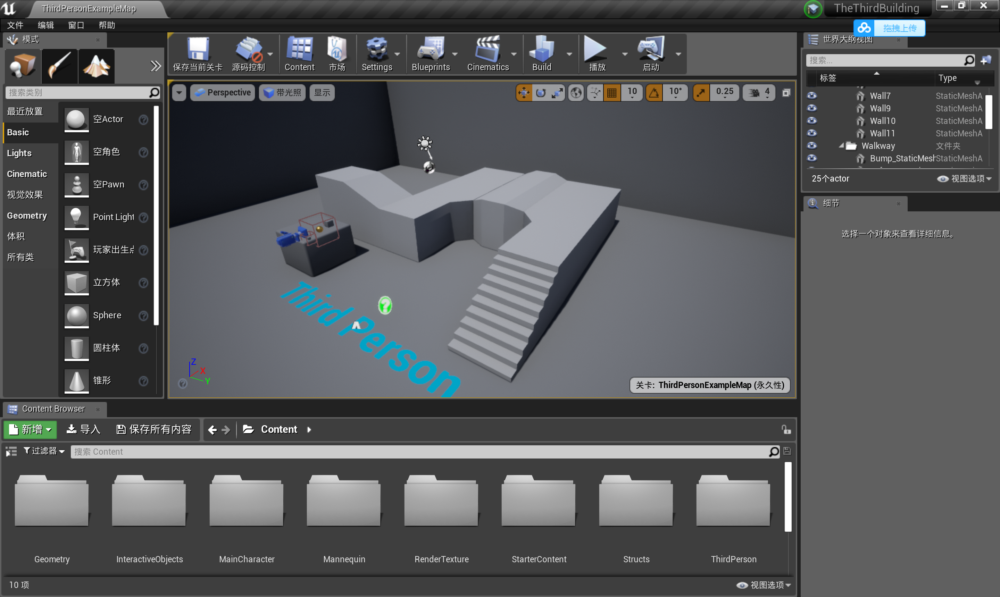
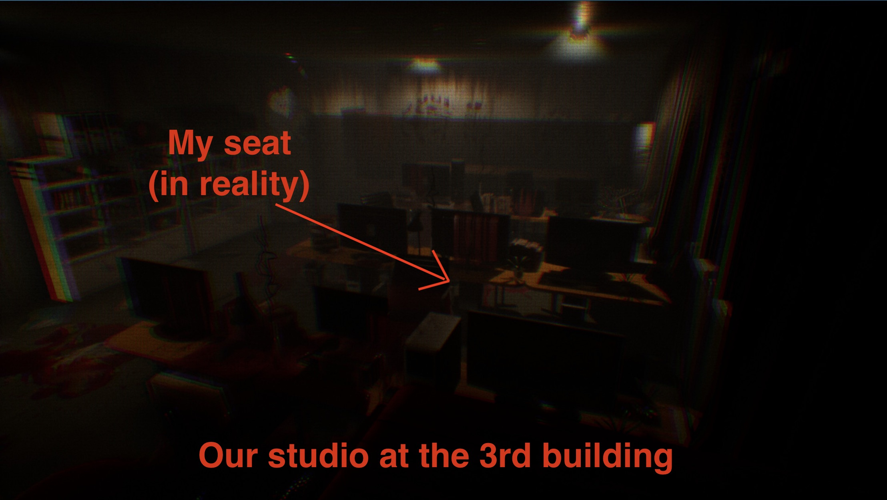
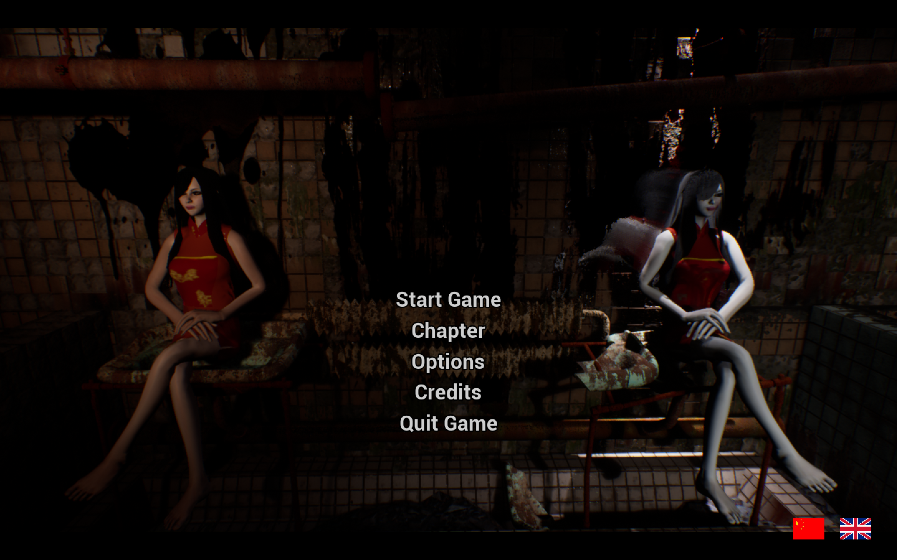
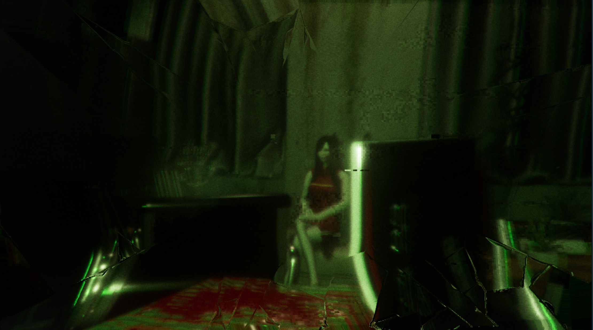

+++
# Date this page was created.
date = 2018-11-10T00:00:00
layout = "project"

# Project title.
title = "3. The 3rd Building"

# Project summary to display on homepage.
summary = """
 This is the star project at the Unreal Studio at UESTC. 
 I'm responsible for part of the game design and game development.
 """
 
image_preview = "img/featured.jpg"

# Tags: can be used for filtering projects.
# Example: `tags = ["Game Development", "Unreal"]`
tags = ["Game Development","Unreal"]

# Optional external URL for project (replaces project detail page).
external_link = ""

# [header]
# image = "img/featured.jpg"

+++

# Overview
This is the star game project at the Unreal Studio at UESTC. Designed and developed by Kaiyan Zhang, Wenhan Hao, and me (also known as the F-Greetings team), we decided to create a horror game based on the 3rd lecture building at UESTC. To be specific, this is a double perspectives and double storylines stealth game. We are planning to publish this game in a completed version in the coming months. There is a demo already published on Steam: https://store.steampowered.com/app/942010/The_3rd_Building/

# Video
<video src="./Demo1.mp4" controls="controls" width="640" height="320" autoplay="autoplay">
Your browser does not support the video tag.
</video>

## My Work
I am responsible for the plot design, part of the level design, and part of the Unreal blue print development--especially in the visual effects.

Early stage level design:

# Features
## Story
This game is based on true stories from the producers. Every school has a haunting building and pieces of mysterious story. The 3rd building, where our studio is located, and where we have spent countless long nights, serves as the place that players want to escape in the first storyline.

In the first chapter, players act in the first-person perspective as the "producer" who is developing a horror game--sounds familiar ha?--and encountering some horrible things. To escape the 3rd building, players need to snake out of the building while avoiding being caught by zombies and solve the puzzles.

## The first-person / third-person perspective

Currently, the game has two storylines, "The Third Building" and "The Fourth Man", playing through the first-person and third-person perspectives, respectively. The "The Third Building" part is the outer line, the real protagonist, a college student independent game developer, he is developing an independent horror game "The Third Building", and some incredible things happened during the development process. The "Fourth Man" part is one of the inner lines extended by the outer line. The protagonist is a mysterious woman. She has the flexible climbing ability and swinging rope ability. She was guided by some mysterious power to the beginning of The Third Building. There are scenes that are common to the inner and outer lines, and there are scenes that belong to one plotline alone. And if you encounter some difficulties in a specific storyline, you can try looking for clues in another line. The two lines are intertwined together to form the story of the "The Third Building"

In the game, players can use multiple perspectives--first-person, night vision, and surveillance cameras. To solve puzzles as well as to find and avoid enemies, players need to change their types of perspective.
For instance, in the normal perspective players cannot spot the mysterious woman in the first chapter. By equipping the night vision, players can easily find out her, thus avoiding being caught.

## Level design

In the level design, we learned some experience from some famous horror games like P.T. and Silent Hill. And we are inspired by Rainbow Six to use surveillance cameras as an assist device, which brought gameplays such as solve a puzzle by switching through multiple cameras.

The main idea of our level design is to create some narrow, linear, and intersected channels that create a scene of imprisonment.

There are many types of impediments that players need to constantly try new methods to get through them--push the box, gather the information separated in the scene, and find a way and time to snake through the way under monitoring zombies, etc..
A demo scene showing our machinery:

That's all I can tell currently because I don't want to spoil the story. The full version game is coming soon! Check out https://store.steampowered.com/app/942010/The_3rd_Building/

