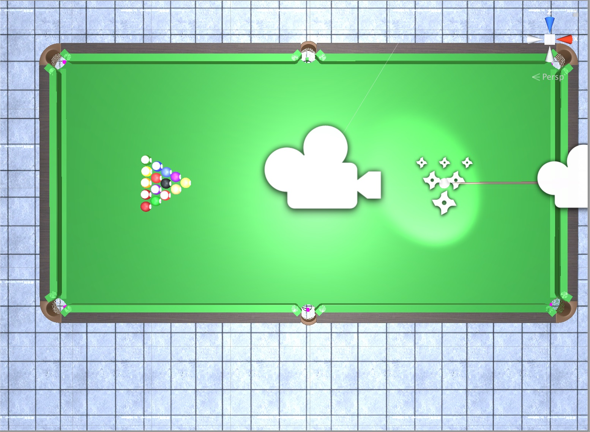
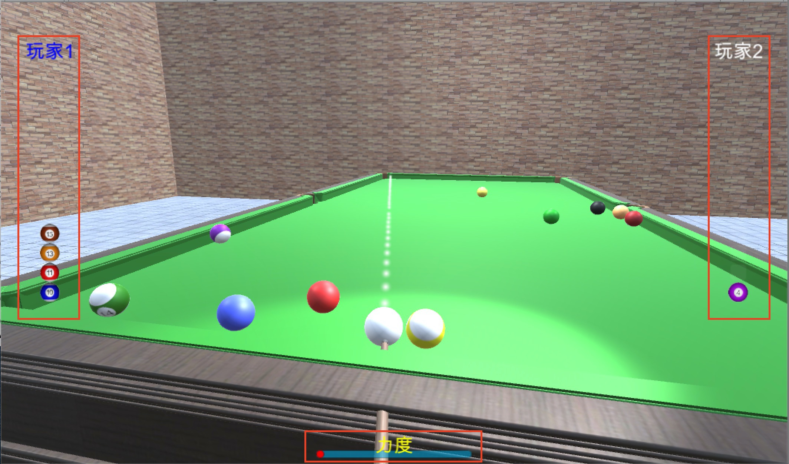

+++
# Date this page was created.
date = 2018-11-10T00:00:00
layout = "project"

# Project title.
title = "6. A Unity3D Billiards Game"

# Project summary to display on homepage.
summary = """
 This is a curriculum project at UESTC. 
 I'm responsible for all the code and game design
 """
 
image_preview = "featured.jpg"

# Tags: can be used for filtering projects.
# Example: `tags = ["Game Development", "Unity3D"]`
tags = ["Game Development","Unity3D"]

# Optional external URL for project (replaces project detail page).
external_link = ""

# [header]
# image = "img/Scene-Test5.jpg"

+++

# Overview
This is a third-person multiplayer tank shooting game developed with Unity 3D.
I am fully responsible for all the game development and design as the course project in Game Engine Architecture at UESTC in 2018.

This project was completed when I was a sophomore. I can do much better now;)

# Features

## Scene

The scene of this game is a classic pool table, with a spotlight constantly fall on the white ball.

## UI

I added a basic UI in this game, showing the current player name and his/her score. At the bottom of the scene, there is a pointer showing the strength of batting.

## Game manipulation

Players can control the club to rotate towards up, down, right, and left by pressing WASD.
By pressing "space", players can accumulate the strength of batting.

# Video
<video src="./Demo1.mp4" controls="controls" width="640" height="320" autoplay="autoplay">
Your browser does not support the video tag.
</video>
