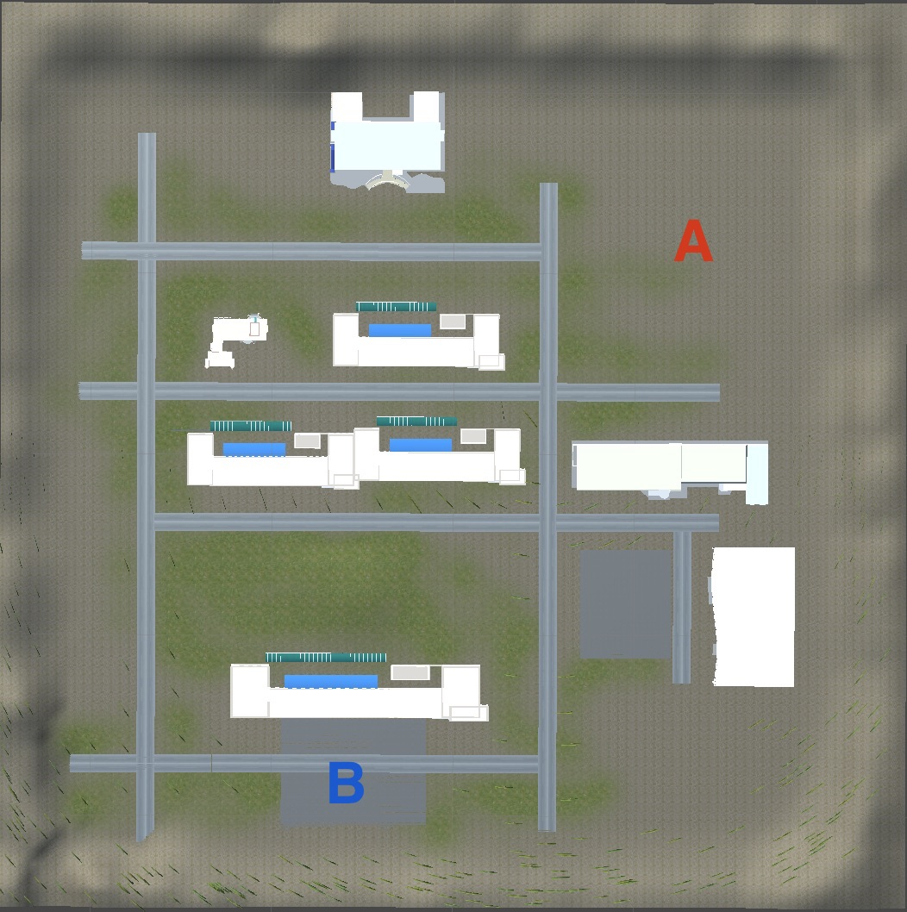

+++
# Date this page was created.
date = 2018-11-10T00:00:00
layout = "project"

# Project title.
title = "A Unity3D Tank Game"

# Project summary to display on homepage.
summary = """
 This is the curriculum project at UESTC. 
 I'm responsible for all the code and game design
 """
 
image_preview = "img/Scene-Test5.jpg"

# Tags: can be used for filtering projects.
# Example: `tags = ["Game Development", "Unity3D"]`
tags = ["Game Development","Unity3D"]

# Optional external URL for project (replaces project detail page).
external_link = ""

# [header]
# image = "img/Scene-Test5.jpg"

+++

# Overview
This is a third-person multiplayer tank shooting game developed in Unity 3D.
I am fully responsible for all the game development and design as the course project in Game Engine Architecture at UESTC in 2018.

It showcased my abilities to:
1. C# programming for Unity 3D.
2. Set up terrain, vegetation, and scenes in Unity 3D.
3. Multiplayer game model programming.
4. Complex modeling.

This project was completed when I was a sophomore. I can do much better now;)

# Features
## Game scenes

The scene of this game is based on the campus of UESTC. And the building models were created by me in another course: Advanced Modeling Technology.

## Level design

While game design wasn't the focus area of this project, I implemented a simple multiplayer level design: Two players are born at spawn point A & B and begin to fight!

## Game mechanisms

In the beginning og this game, players will be showen the following scene. Players can choose to host a new game or join others' game by entering the local host number.

Players can move and rotate their tanks by pressing W A S D. 

By entering "space", they can fire a shell. The field of fire depends on the time players pressing "space" demonstrated as following:

