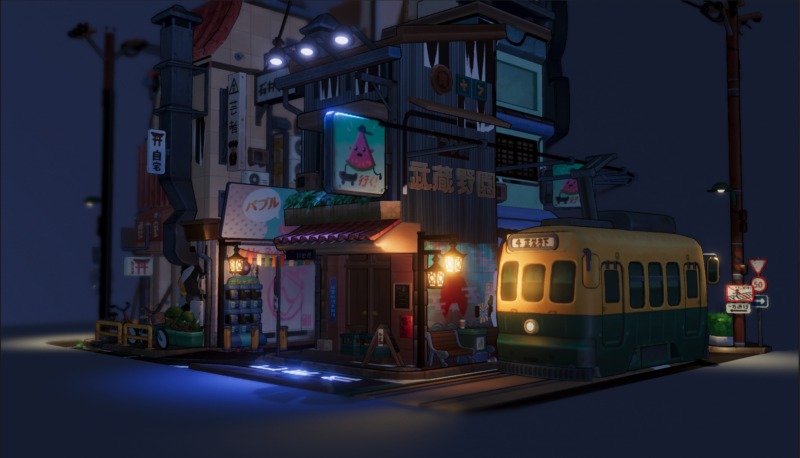
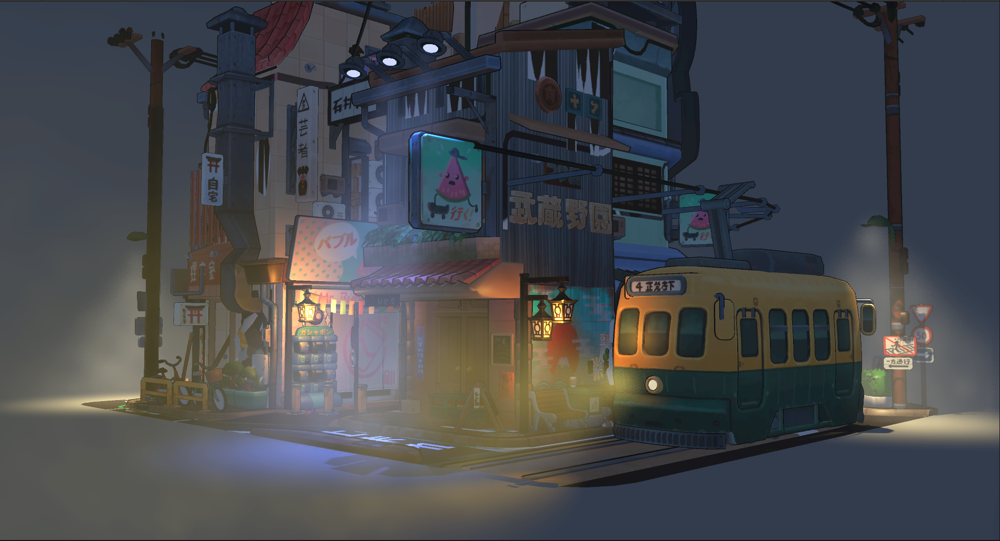
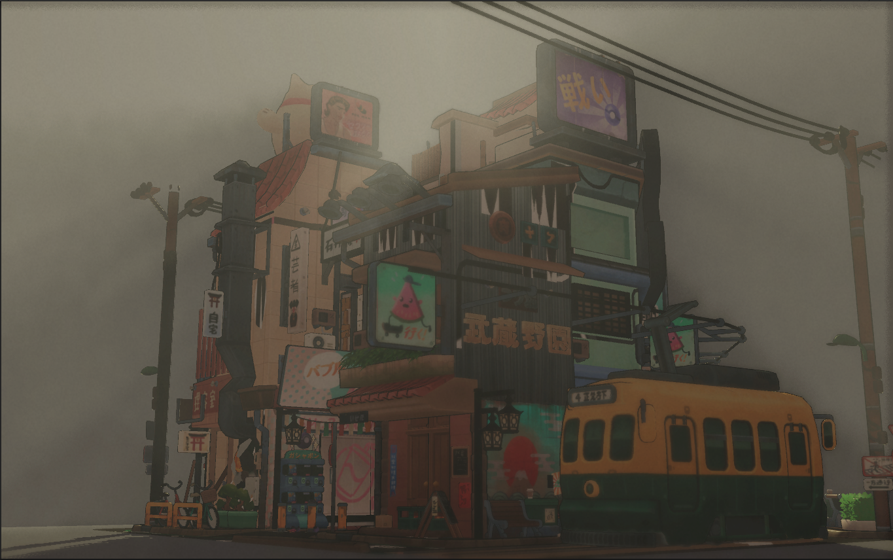
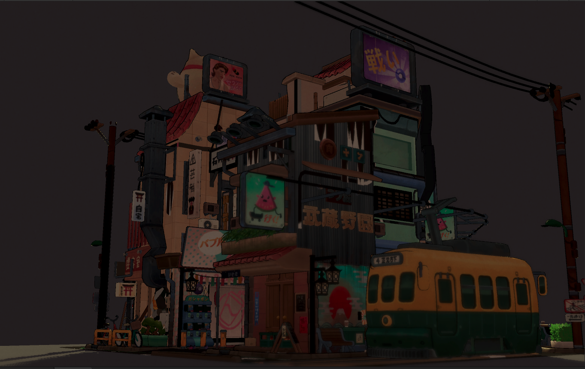
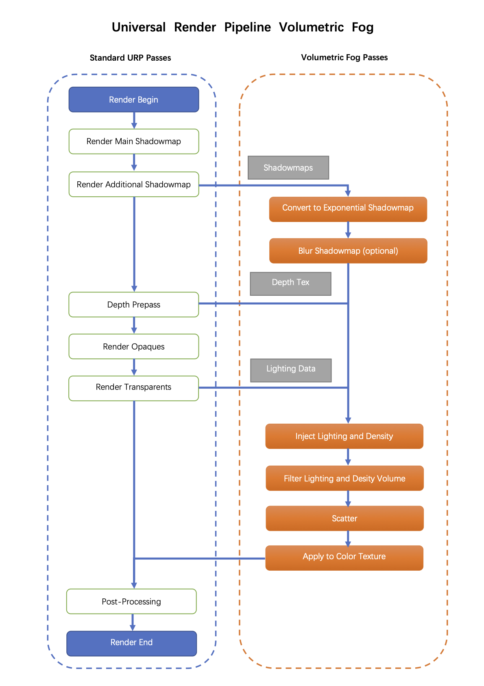
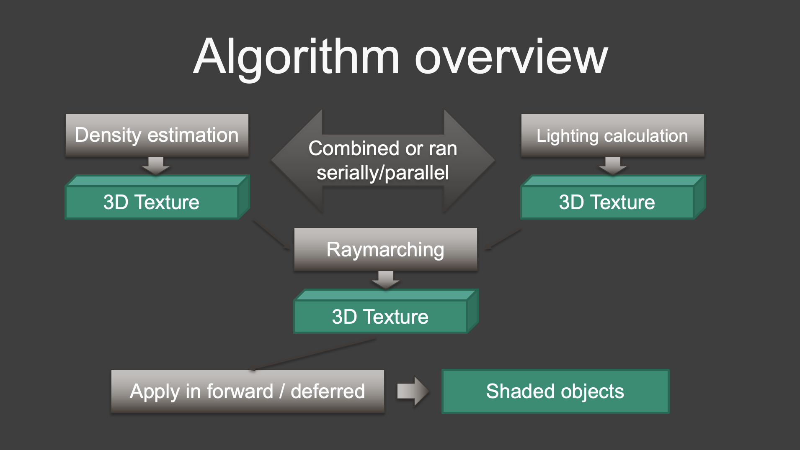
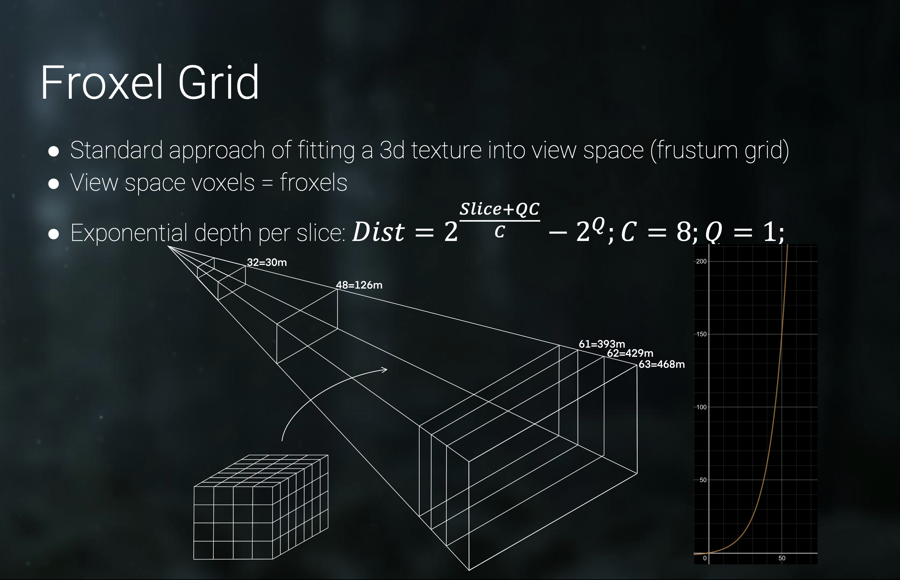
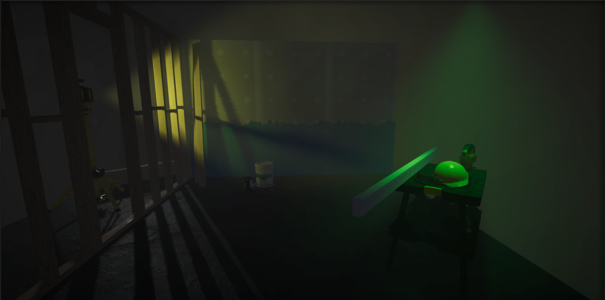

+++
# Date this page was created.
date = 2018-11-10T00:00:00
layout = "project"

# Project title.
title = "Efficient Froxel Based Volumetric Fog Render Feature"

# Project summary to display on homepage.
summary = """
Efficient froxel-based volumetric fog render feature for Unity URP. I was responsible to build the custom render feature and compute shaders. 
 """
 
image_preview = "img/overview.png"

# Tags: can be used for filtering projects.
# Example: `tags = ["Texture", "Substance Designer"]`
tags = ["Computer Graphics","Rendering"]

# Optional external URL for project (replaces project detail page).
external_link = ""

# [header]
# image = "img/overview.png"

+++

# Overview
This render feature simulates the in-scattering and out-scattering phenomenon when media participates in light transport. 
<video src="./DynamicFog.mp4" controls="controls" width="640" height="320" autoplay="autoplay">
Your browser does not support the video tag.
</video>

# Shadow
<video src="./Shadow.mp4" controls="controls" width="640" height="320" autoplay="autoplay">
Your browser does not support the video tag.
</video>

# Algorithm overview

We implemented volumetric textures as intermediate storage, and used compute shaders and UAVs to raymarch and write efficiently. 
1. First and most important part is performing lighting and shadowing calculations for every volume cell. 
2. In parallel, we estimated and animated the participating media density.
3. Then using this information stored in volume textures, we performed 2D raymarching through the volume and stored the result in volume slices.
4. And finally using pixel shaders, applied information on screen for forward or deferred shaded objects.

#Code Sample

# More detail coming soon!

