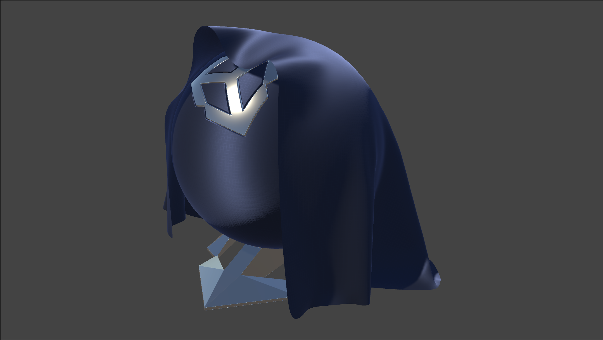

+++
# Date this page was created.
date = 2018-11-10T00:00:00
layout = "project"

# Project title.
title = "Fabric Shading with Unity URP"

# Project summary to display on homepage.
summary = """
A comprehensive Shader-Graph-based fabric shading solution, extremely artist-friendly. 
I built the Master Node that implemented fabric BRDFs, anisotropy specular, and translucency, etc..
 """

image_preview = "img/overview.png"

# Tags: can be used for filtering projects.
# Example: `tags = ["Computer Graphics", "Rendering"]`
tags = ["Computer Graphics","Rendering"]

# Optional external URL for project (replaces project detail page).
external_link = ""

# [header]
# image = "img/overview.png"

+++

# Overview

To give artists the flexibility to create various types of fiber while using different pipeline standards, we created this Shader-Graph-based fabric shading solution. While shading fibers in a physically based manner, we guaranteed that artists can use shader graphs to process their inputs. For instance, artists can choose the sources as the normal input--from normal maps, thread maps, or detail maps. We created the master node with two types of BRDF for silk-like and cotton-like fibers. Also, we implemented the commonly used features for fabric shading--translucency, anisotropic specular, and an extended two-sided rendering option. 
I was responsible to build the Shader Graph nodes to support artists' work. I was responsible for the C# and HLSL coding, BRDFs research, Shader Graph nodes creation, and Demo creation using Substance Designer. 

## Material Samples

# Features
## Cotton Shading
For common cotton shading, we highlighted the following featured based on observations from reality:
1. Soft specular lobe with large smooth falloffs.
2. Fuzz on the rim from asperity scattering.
3. Low specular contribution at front facing angles.
One extreme example is Linen:

## Translucency
We implemented translucency effect for thin fibers:

## Silk Shading
Silk-like fibers feature anisotropic specular highlights and separate specular color that gives the material an iridescent look:

Notice the fuzz color deviation on the base map.

## Shader Graph Workflow
We provided a general Shader Graph for artists to create their own fibers. By blending the details and patterns, artists can easily create differentiated types of material using a few input textures.

## Shader Graph Master Node Extension
We extended the Shader Graph material type in URP. Added the "Fabric" option in the Graph Inspector, users can convert their Lit shader to our Fabric shader. 

To better mimic the surface feature of fiber, we implemented two types of BRDF--"Cotton: for rough fibers and "Silk" for smooth fibers in general. 

Two-sided rendering options were extended to support flipped-normal and mirrored-normal.

