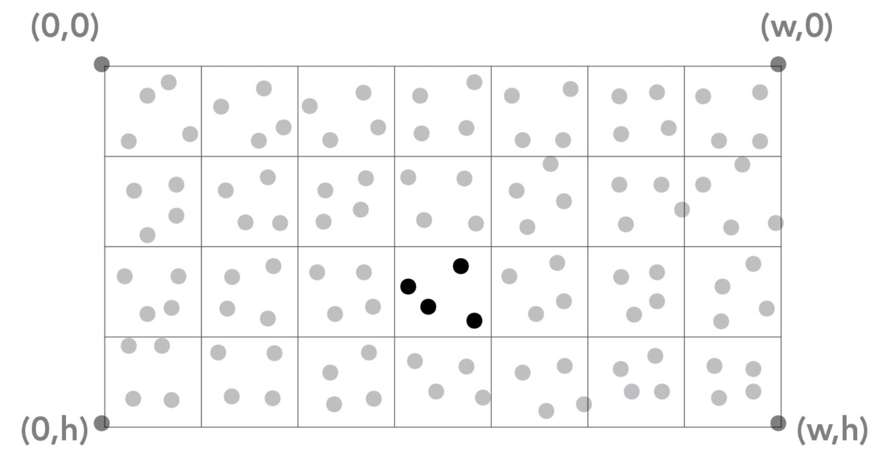
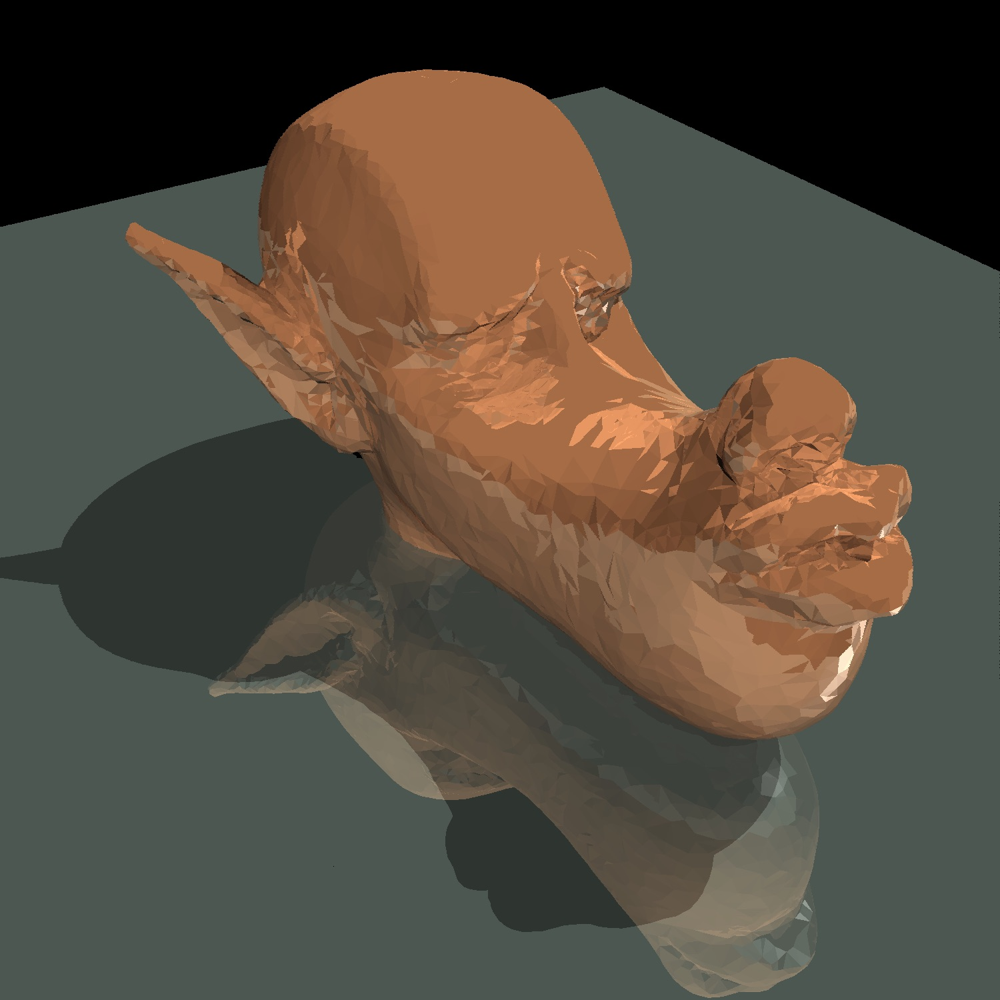
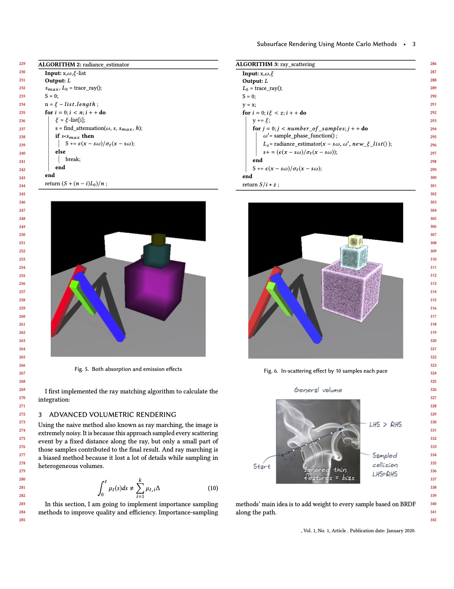
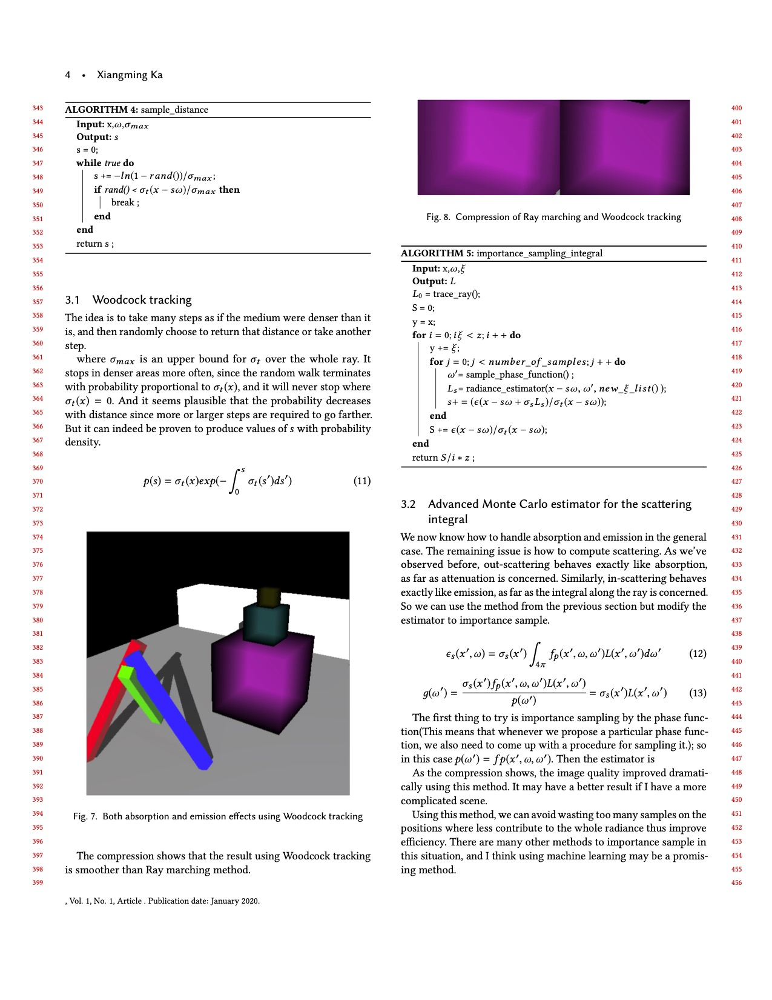
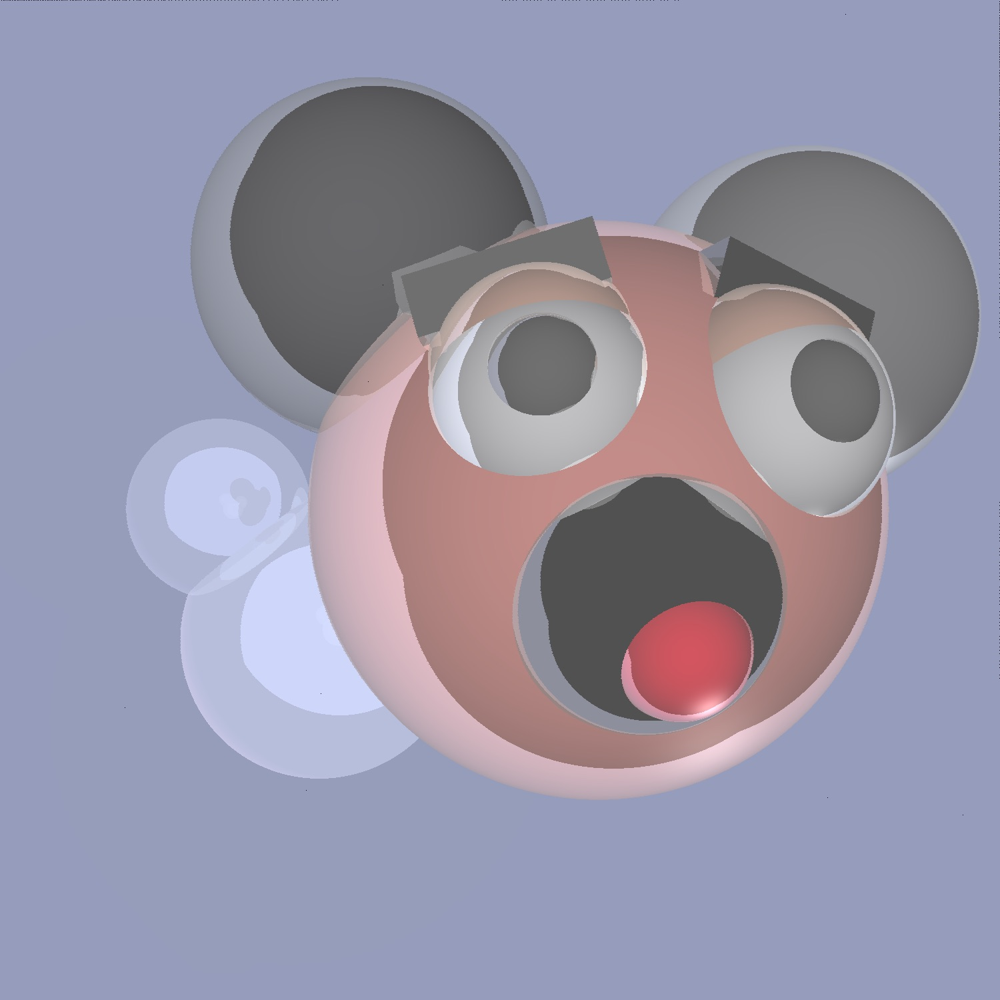

+++
# Date this page was created.
date = 2018-11-10T00:00:00
layout = "project"

# Project title.
title = "Advanced Character Rendering in Unity URP"

# Project summary to display on homepage.
summary = """
 Advanced character rendering subject at Unity Technologies, including Screen-Space Subsurface Scattering (5S), skin shading, and eye shading. 
 I'm fully responsible for the 5S render feature development, compute shader creation, physically-based skin shader and eye shader creation.
 """
 
image_preview = "img/overview.jpg"

# Tags: can be used for filtering projects.
# Example: `tags = ["Computer Graphics", "Rendering"]`
tags = ["Computer Graphics","Rendering"]

# Optional external URL for project (replaces project detail page).
external_link = ""

# [header]
# image = "img/Scene-Test5.jpg"

+++

# Overview
To achieve high fidelity character rendering, we implement multiple rendering techniques in Universal Render Pipeline, including a highly optimized screen-space subsurface scattering render feature, specialized PBR skin shader, and complicated eye shader that simulates refractions. All of these features are highly performance-optimized to support mobile and VR platforms.

<video src="./demo1.mp4" controls="controls" width="640" height="320" autoplay="autoplay">
Your browser does not support the video tag.
</video>

# Screen-Space Subsurface Scattering
## Ray Tracing

To render the subsurface scattering effect, I developed a Custom Render Feature to extend the Universal Render Pipeline. The specular and diffuse light contributions of the skin are stored separately in two textures and passed to the next render pass. A compute shader is implemented to calculate the final blurry scattered image using Burley’s normalized diffusion model.

We use the Diffusion Profile to control the subsurface scattering. I developed the supporting shader GUI and profile management system.

<video src="./demo1.mp4" controls="controls" width="640" height="320" autoplay="autoplay">
Your browser does not support the video tag.
</video>

## Monte-Carlo integration & Path Tracing

To support pixel antialiasing, I implemented a box filter over the pixel footprint and depth of field by integrating over the aperture of the camera illustrated as follows:

As for the depth-of-field effect, I simulated an imaginary thin lens with a fixed aperture to produce a nice depth-of-field effect, where some objects will be sharp but others blurry.

Original scene:

Depth-of-field effected scene:

Now, here is the most important part! 
A basic Monte-Carlo estimater was implemented to sample radiance of the hemisphere.

By integrating the radiance coming from the hemisphere, we could estimate the radiance of indirect illumination. So far, we can get the global illuminated scenes as follows.

## Final thesis

Also, I added a basic volumetic scattering effect estimater in this path tracer and wrote a final paper in SIGGRAPH tamplate which discussed principles of volumetic rendering and path tracing.

For more information and source code: https://github.com/XiangmingKA/PathTracer

