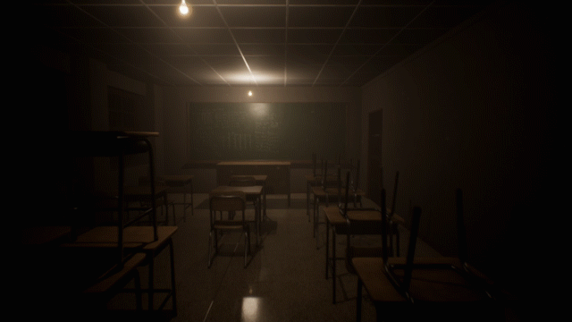

+++
# Date this page was created.
date = 2018-11-10T00:00:00
layout = "project"

# Project title.
title = "UE4 Indie game: The Third Building"

# Project summary to display on homepage.
summary = """
 A horror game based on the mysterious story in our campus. Released on Steam! I was responsible for the gameplay programming based on blueprint and visual development based on Material Editor. 
 """
 
image_preview = "img/overview.jpeg"

# Tags: can be used for filtering projects.
# Example: `tags = ["Game Development"]`
tags = ["Game Development"]

# Optional external URL for project (replaces project detail page).
external_link = ""

# [header]
# image = "img/Scene-Test5.jpg"

+++

# Overview

A horror game based on the mysterious story in our campus. I was responsible for part of the gameplay programming based on blueprint and visual development based on Material Editor. 

<video src="img/video.mp4" controls="controls" width="640" height="320" autoplay="autoplay">
Your browser does not support the video tag.
</video>

# Check out on Steam:
https://store.steampowered.com/app/942010/The_3rd_Building/

