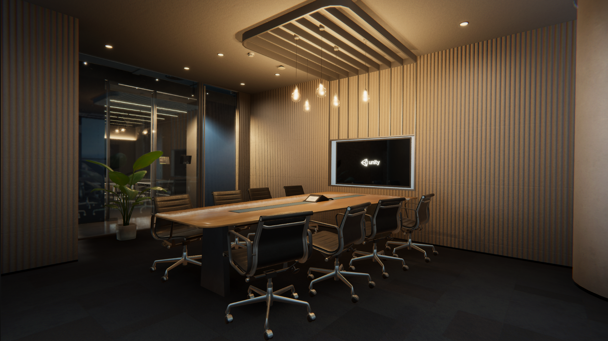

+++
# Date this page was created.
date = 2021-06-10T00:00:00
layout = "project"

# Project title.
title = "Unity Shanghai Office RTX Demo"

# Project summary to display on homepage.
summary = """
Unity Shanghai Office Real-Time Ray Tracing Demo. Made with Unity HDRP.
I am responsible for the environment lighting.  
 """
 
image_preview = "img/overview.png"

# Tags: can be used for filtering projects.
# Example: `tags = ["Texture", "Substance Designer"]`
tags = ["Lighting"]

# Optional external URL for project (replaces project detail page).
external_link = ""

# [header]
# image = "img/overview.png"

+++

# Unity Shanghai Office Real-Time Ray Tracing Demo
I duties including environment lighting, assets improvement, and Photometry.

# Featured

