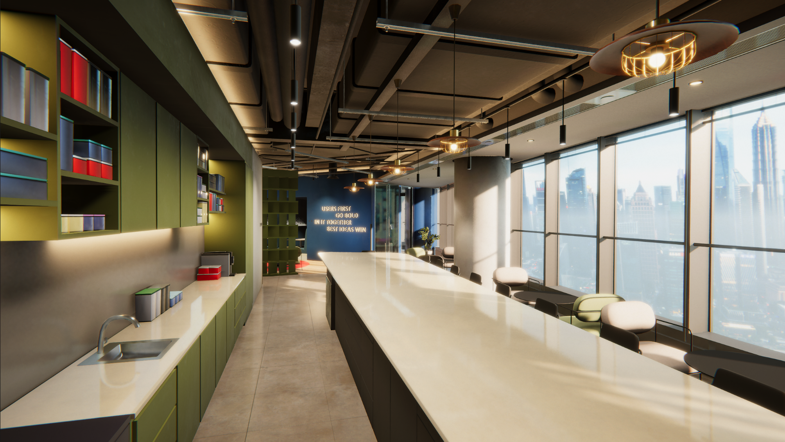
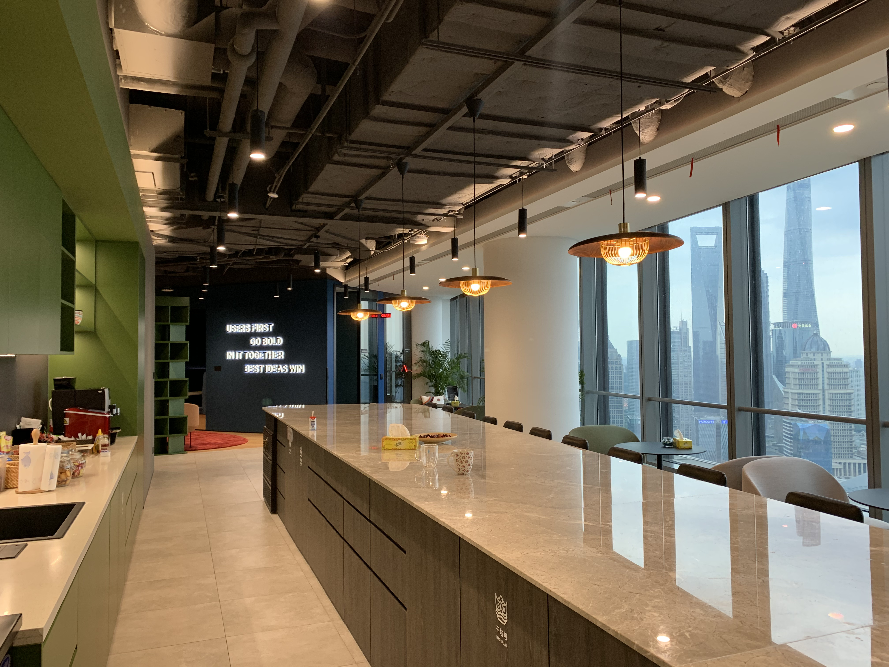
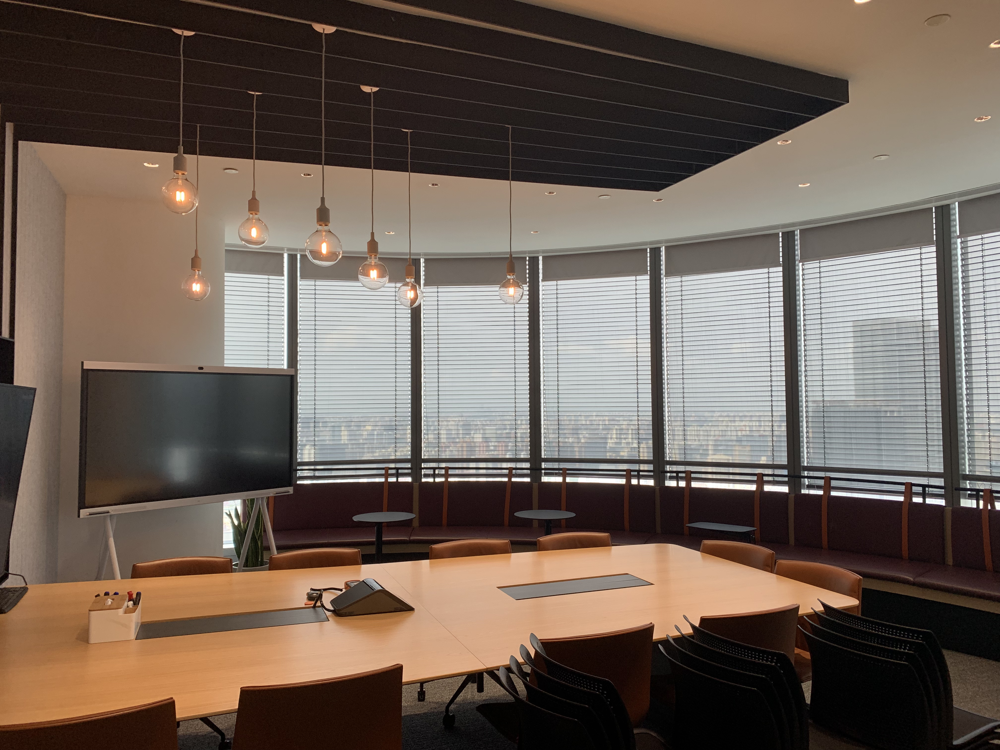
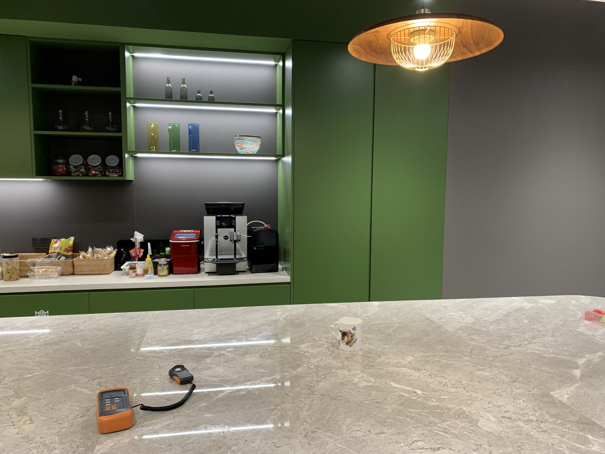
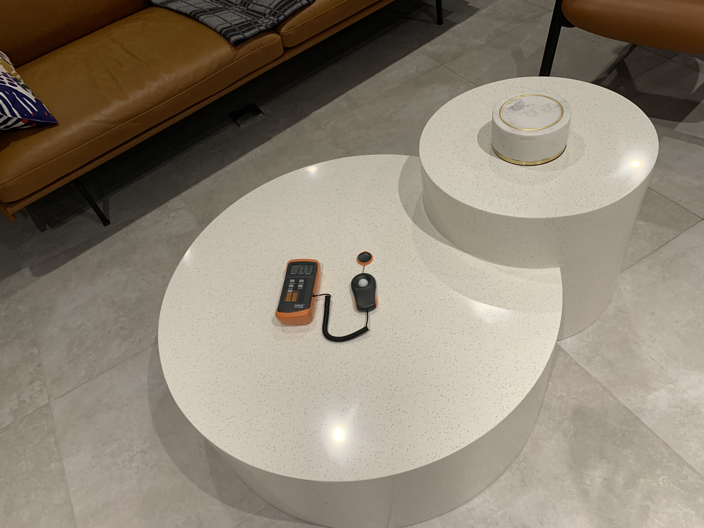
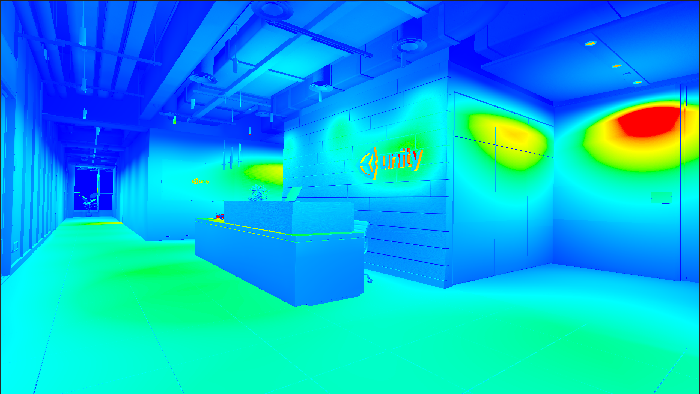
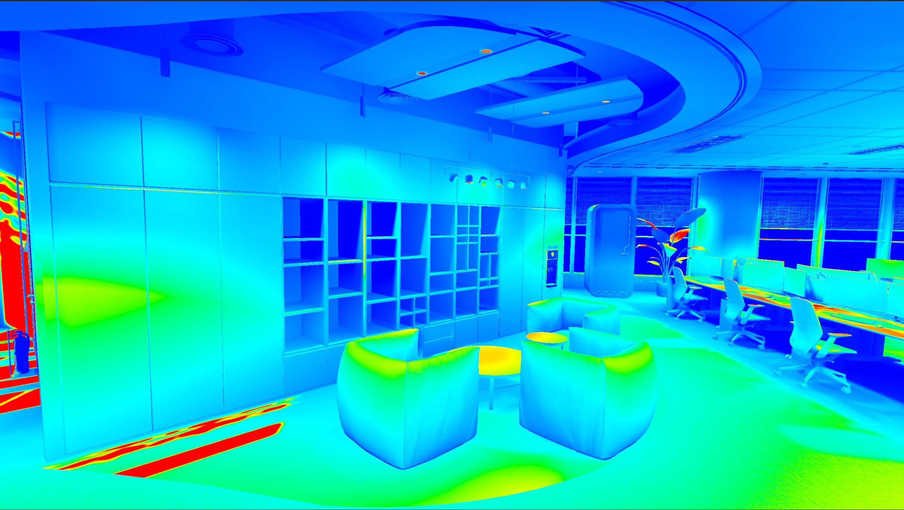
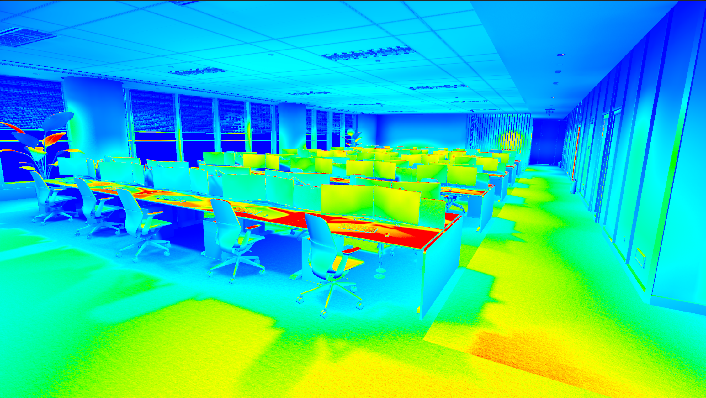

+++
# Date this page was created.
date = 2021-06-10T00:00:00
layout = "project"

# Project title.
title = "Unity Shanghai Office RTX Demo"

# Project summary to display on homepage.
summary = """
Unity Shanghai Office Real-Time Ray Tracing Demo. Made with Unity HDRP.
I am responsible for the environment lighting.  
 """
 
image_preview = "img/overview.png"

# Tags: can be used for filtering projects.
# Example: `tags = ["Texture", "Substance Designer"]`
tags = ["Lighting"]

# Optional external URL for project (replaces project detail page).
external_link = ""

# [header]
# image = "img/overview.png"

+++

# Unity Shanghai Office Real-Time Ray Tracing Demo
My duties including environment lighting, assets improvement, and Photometry.
We rendered those scenes using Unity's HDRP with real-time ray tracing. To achieve photorealism, we measured the light energy distribution in the real world and reconstructed in our virtual office. I also helped our team to fix errors in models and textures. 

# Featured

Reception

Reference:

Pantry

Reference:

Boardroom

Reference:

# Real-Time Ray Tracing
We experienced the real-time ray tracing features in HDRP including ray traced reflection, ray tracing shadows, ray tracing AO, etc..
RTX On:
 
 
 RTX Off:
 

# Photometry
We measured light energy distribution in the real world and reconstructed in our virtual office.
Measuring light energy using Lux meter:
 
 
 Lighting using  HRDP's Physical Light and Lux Meter units.
 
 
 

